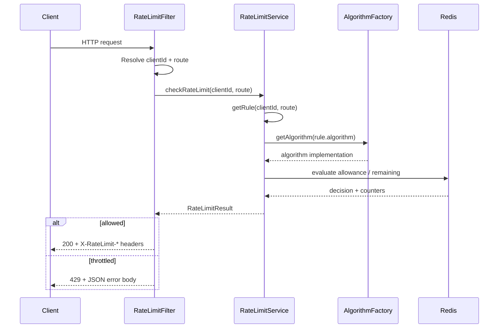
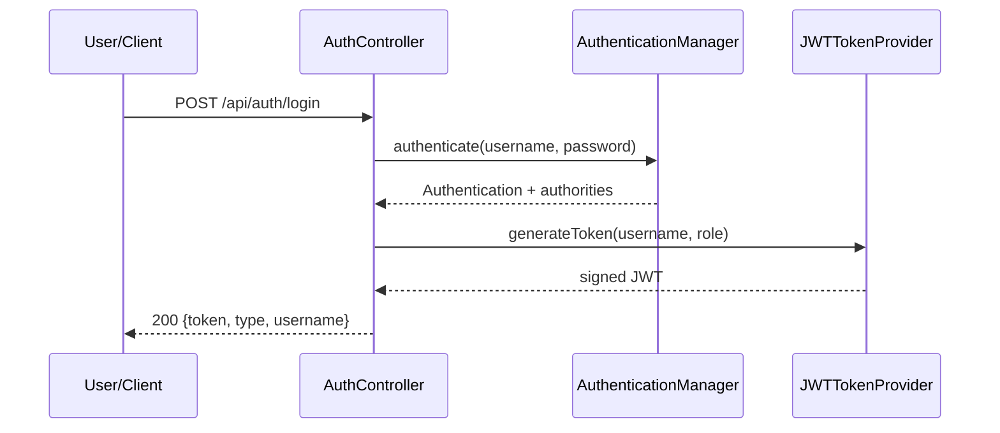
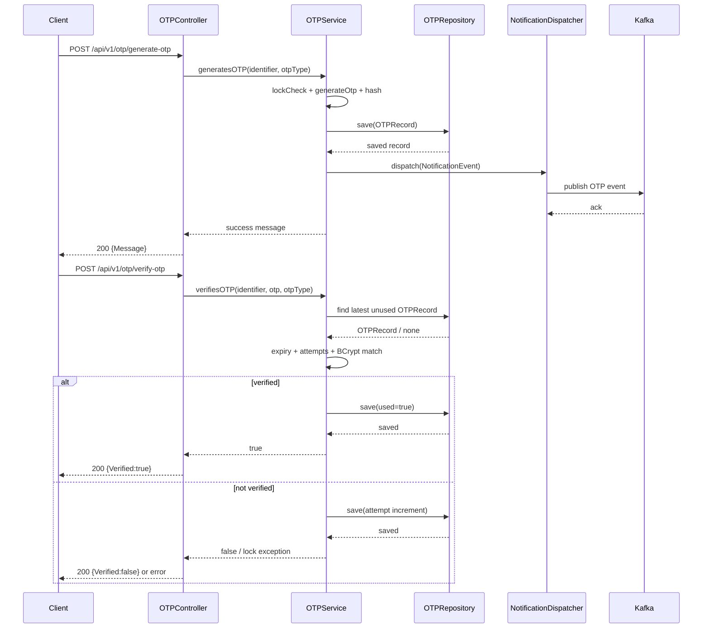
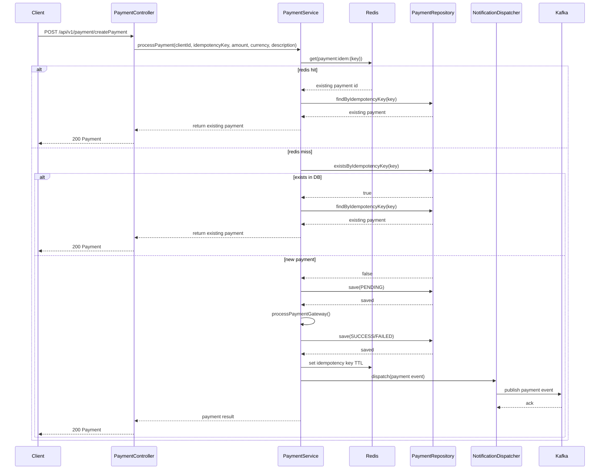
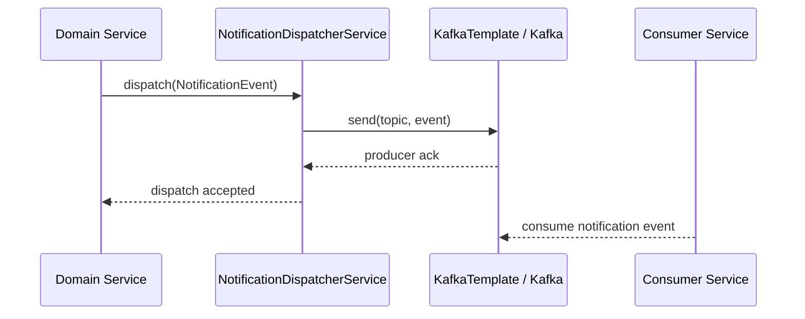
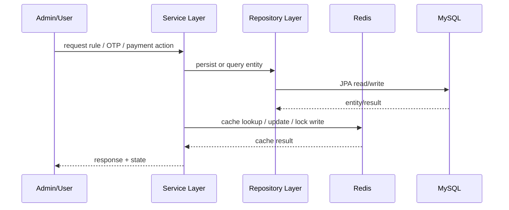
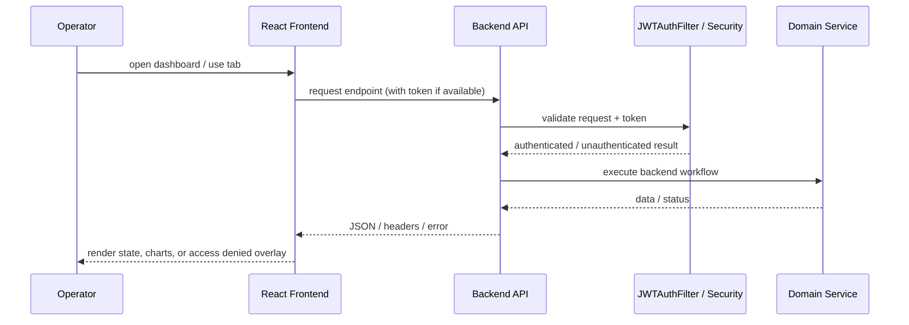

# Rate-Sentinel Low Level Design (LLD)

Version: 1.0
Date: 2026-07-16
Project: rate-sentinel

## 1. Scope

This LLD defines module-level and class-level design for key runtime capabilities:

- LLD-1: Rate limiting decision engine
- LLD-2: Authentication and security filter chain
- LLD-3: OTP generation and verification
- LLD-4: Idempotent payment processing
- LLD-5: Notification dispatch over Kafka
- LLD-6: Data model and persistence behavior

## 2. LLD-1: Rate Limiting Decision Engine

Primary classes:

- `filter/RateLimitFilter.java`
- `service/RateLimitService.java`
- `algorithm/RateLimitAlgorithmFactory.java`
- `algorithm/SlidingWindowAlgorithm.java`
- `algorithm/TokenBucketAlgorithm.java`
- `algorithm/FixedWindowAlgorithm.java`

### 2.1 Responsibilities

- `RateLimitFilter`
  - Resolve `clientId` (request attribute from JWT or IP fallback).
  - Skip exempt routes (`/actuator`, `/api/auth`, `/favicon.ico`).
  - Invoke service and write `X-RateLimit-*` headers.
  - Return 429 JSON body for denied requests.

- `RateLimitService`
  - Resolve best matching rule using priority and pattern matching.
  - Use cache for rule lookup and fallback defaults when needed.
  - Delegate quota checks to selected algorithm strategy.

- Algorithm implementations
  - `SlidingWindowAlgorithm`: high-accuracy windowing using Redis ZSET and atomic Lua script.
  - `TokenBucketAlgorithm`: burst-support with refill calculations.
  - `FixedWindowAlgorithm`: low-overhead counter per bucket.

### 2.2 Rule Selection Logic

Rule resolution order:

1. Exact (`clientId`, `route`)
2. Wildcard client (`*`, `route`)
3. Pattern route match among active rules for client or wildcard client
4. Global (`*`, `*`)
5. Hardcoded default from properties

### 2.3 Runtime Sequence

1. `RateLimitFilter#doFilterInternal`
2. `RateLimitService#checkRateLimit`
3. `RateLimitService#getRule`
4. `RateLimitAlgorithmFactory#getAlgorithm`
5. `RateLimitAlgorithm#isAllowed` and `#getRemaining`
6. Filter writes headers and either stops (429) or forwards chain

### 2.4 Sequence Diagram

## 3. LLD-2: Authentication and Security

Primary classes:

- `filter/JWTAuthFilter.java`
- `security/JWTTokenProvider.java`
- `config/SecurityConfig.java`
- `config/UserConfig.java`
- `controller/AuthController.java`

### 3.1 Filter Chain Positioning

- `JWTAuthFilter` is placed before `UsernamePasswordAuthenticationFilter`.
- It parses Bearer token, validates signature/expiry, and stores principal in security context.
- It sets `request.setAttribute("clientId", subject)` for downstream rate limiting.

### 3.2 Access Model

- Public: `/api/auth/**`, `/actuator/**`
- Authenticated: all other endpoints
- Admin-specific authorization enforced by route and role-based logic where configured.

### 3.3 Login Flow

1. `AuthController` accepts credentials.
2. `AuthenticationManager` authenticates principal.
3. `JWTTokenProvider` creates signed token with role claim and expiration.
4. Token is returned to caller for subsequent protected calls.

### 3.4 Sequence Diagram

## 4. LLD-3: OTP Generation and Verification

Primary classes:

- `service/OTPService.java`
- `controller/OTPController.java`
- `repository/OTPRepository.java`
- `model/OTPRecord.java`

### 4.1 Generate OTP (`generatesOTP`)

1. Check lock key `otp:lock:{identifier}` in Redis.
2. Generate random numeric OTP (`SecureRandom`) with configured length.
3. Hash OTP via BCrypt.
4. Persist OTP record with expiry timestamp.
5. Build and dispatch `NotificationEvent`.
6. Return success response.

### 4.2 Verify OTP (`verifiesOTP`)

1. Check lock status.
2. Fetch latest unused OTP record for identifier/channel.
3. Validate expiry.
4. Increment attempts and evaluate max-attempt threshold.
5. On threshold breach, create lock key with configured lockout TTL.
6. Compare input OTP against BCrypt hash.
7. If matched, mark record as used and return true; else return false.

### 4.3 Error Conditions

- No active OTP record found.
- OTP expired.
- Account currently locked due to excessive attempts.

### 4.4 Sequence Diagram

## 5. LLD-4: Idempotent Payment Processing

Primary classes:

- `service/PaymentService.java`
- `controller/PaymentController.java`
- `repository/PaymentRepository.java`
- `model/Payment.java`

### 5.1 Processing Steps (`processPayment`)

1. Build Redis key `payment:idem:{idempotencyKey}`.
2. If Redis key exists, return existing payment by idempotency key.
3. Else check durable existence in MySQL repository.
4. If absent, create `Payment` as `PENDING` and persist.
5. Execute gateway operation (currently internal method placeholder).
6. On success: set `SUCCESS`, set `processedAt`, persist, cache key in Redis with TTL.
7. On failure: set `FAILED`, persist failure reason.
8. Dispatch corresponding notification template.

### 5.2 Consistency Notes

- DB unique constraint on idempotency key prevents duplicate inserts.
- Redis accelerates retries while DB remains source of truth.
- Event dispatch is asynchronous and does not block payment API response.

### 5.3 Sequence Diagram

## 6. LLD-5: Notification Dispatch

Primary classes:

- `service/NotificationDispatcherService.java`
- `config/KafkaConfig.java`
- `model/NotificationEvent.java`
- `enums/NotificationChannel.java`

### 6.1 Topic Routing

- Channel-to-topic mapping is resolved using application properties.
- Kafka producer uses String key serializer and JSON value serializer.
- Topics are provisioned through `NewTopic` beans during startup.

### 6.2 Dispatch Contract

`NotificationEvent` payload fields:

- eventId, clientId, recipient
- channel, templateId, templateParams
- priority, correlationId

Dispatch behavior:

- Service logs enqueue outcome.
- Failures are logged; API workflows remain non-blocking.

### 6.3 Sequence Diagram

## 7. LLD-6: Persistence and Caching Design

Primary entities and repositories:

- `RateLimitRule` <-> `RateLimitRuleRepository`
- `OTPRecord` <-> `OTPRepository`
- `Payment` <-> `PaymentRepository`

### 7.1 MySQL Persistence

- JPA/Hibernate with schema auto-update (`spring.jpa.hibernate.ddl-auto=update`).
- Rule table stores algorithm and quota parameters.
- OTP table stores hashed OTP with status and attempts.
- Payment table stores idempotency lifecycle.

### 7.2 Redis Usage Matrix

- Counters/state for rate-limiter algorithms.
- OTP lockout keys and timeout control.
- Idempotency cache for payment retries.
- Rule lookup cache with TTL and eviction on admin updates.

### 7.3 Sequence Diagram

## 8. Configuration and Operational Parameters

From `application.properties`:

- OTP: length, expiry, max attempts, lockout
- JWT: secret, expiration
- Rate-limiter defaults: limit, window, algorithm
- Redis and Kafka connectivity

Operational guidance:

- Keep JWT secret externalized per environment.
- Keep Redis timeouts and pool settings aligned with expected traffic.
- Tune topic partitions based on event throughput.

## 9. Known Constraints and Design Considerations

- Current payment gateway integration method is a placeholder; production adapter needed.
- Security config currently permits all authenticated traffic beyond explicit public routes.
- Endpoint naming conventions are mixed (`/api/v1/payment/createPayment`); standardization recommended.
- LLD assumes single-region deployment with shared Redis/Kafka.

## 10. Frontend Module Design

Primary frontend files:

- `frontend/src/App.jsx`
- `frontend/src/App.css`
- `frontend/src/index.js`
- `frontend/src/index.css`

### 10.1 UI Composition

- Global styling and design tokens are defined in `App.jsx` and injected at runtime.
- A Three.js particle field and scanline overlay provide the animated dashboard background.
- The shell uses tabbed navigation with role-aware access handling.

### 10.2 Frontend Tabs

- `Overview`
  - Shows system summary, API endpoints, live statistics, and algorithm details.
  - Reads backend state using the current token when available.
- `Rate Rules`
  - Lists configured rate-limit rules and supports admin CRUD workflows.
  - Uses the admin rules API and reflects cache-eviction driven updates.
- `OTP Tester`
  - Calls `/api/v1/otp/generate-otp` and `/api/v1/otp/verify-otp`.
  - Provides visible success/failure feedback and access-denied overlay handling.
- `Payments`
  - Calls payment creation flow with `Idempotency-Key` support.
  - Surfaces duplicate request behavior and returned payment state.

### 10.3 API Integration Pattern

- Central `api` helper wraps `fetch` calls for POST/GET/PUT/DELETE.
- JWT token is injected as `Authorization: Bearer ...` when present.
- JSON and form-encoded requests are both supported to match backend endpoint contracts.

### 10.4 Operational Notes

- Frontend development server runs on `http://localhost:3000`.
- Backend API base URL is `http://localhost:8080`.
- CORS is configured in backend security to allow the local frontend origin.

### 10.5 Sequence Diagram

## 10. Fix and Flow Consolidation Notes

- **Rate limiting correctness:** `SlidingWindowAlgorithm` uses an atomic Lua script for
  remove-count-check-add-expire execution in one Redis operation.
- **Rule applicability:** `RateLimitService` applies exact, wildcard, and pattern-based lookup,
  then falls back to global and property defaults.
- **Cache consistency:** Admin rule create/update/delete endpoints evict `rate-limit-rules` cache.
- **Caller identity alignment:** `JWTAuthFilter` sets `clientId` request attribute, consumed by
  `RateLimitFilter` before IP fallback.
- **Payment deduplication flow:** Redis fast-path and MySQL durable check are both used before
  creating a new payment row.

